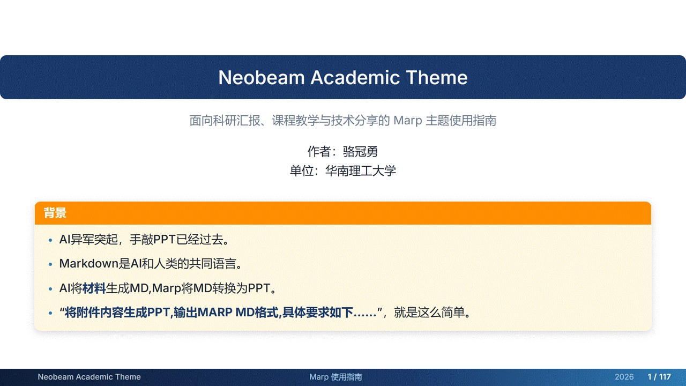

# OverView: A professional Marp theme for academic talks and teaching



---
<!-- _class: title -->

# Neobeam Academic Theme

> 面向科研汇报、课程教学与技术分享的 Marp 主题使用指南

作者：骆冠勇
单位：华南理工大学

<div class="beamer amber left w-90 " data-label="背景">

- AI异军突起，手敲PPT已经过去。
- Markdown是AI和人类的共同语言。
- AI将**材料**生成MD,Marp将MD转换为PPT。
- “**将附件内容生成PPT,输出MARP MD格式,具体要求如下......**”，就是这么简单。

</div>

---

<!-- _class: section theme-slate -->

# Marp 基础介绍

## Markdown 驱动的现代幻灯片制作工具

<div class="box green" data-label="主要内容">

- Marp 是什么
- 适合做什么
- 一个 Marp 文件怎么写
- 如何在 VS Code 中使用
- 如何配置自定义主题
- 如何导出
- 如何用 CLI 自动化生成 PPT / PDF / HTML

</div>

---

# 什么是 Marp？

Marp 是一个基于 Markdown 的幻灯片制作生态，适合用纯文本方式快速编写、维护和导出演示文稿。

<div class="columns-6-4">

<div>

## 核心特点

- 使用 Markdown 编写幻灯片
- 支持主题 CSS 自定义
- 支持 PDF、PPTX、HTML 等格式导出
- 支持数学公式、代码块、图片和表格
- 适合版本管理与团队协作

</div>

<div>

<div class="box info" data-label="适合谁使用？">
科研人员、教师、学生、开发者、技术写作者，以及需要长期维护演示文稿的人。
</div>

<div class="box success" data-label="核心优势">
把 PPT 内容变成可读、可复用、可追踪的 Markdown 文档。
</div>

</div>

</div>

---

# Marp 适用场景

Marp 特别适合结构化、可复用、重视内容维护的演示场景。


| 场景       | 说明                                   |
| ---------- | -------------------------------------- |
| 科研汇报   | 论文解读、组会报告、开题答辩、学术会议 |
| 课程教学   | 课件、讲义、习题讲解、知识点总结       |
| 技术分享   | 架构说明、代码演示、项目复盘           |
| 文档型演示 | 产品介绍、培训材料、方案汇报           |
| 团队协作   | 使用 Git 管理版本、多人协同修改        |

<div class="box info" data-label="Tip">
如果你的演示内容需要频繁修改、多人协作或保留版本历史，Marp 会比传统 PPT 更容易维护。
</div>

---

# Marp 的基本工作方式

Marp 的基本思想是：**用 Markdown 写内容，用 CSS 控制样式，用工具导出演示文件。**

<div class="columns-3">

<div>

### 1. 编写

使用 Markdown 编写内容：

```markdown
# 标题

- 要点一
- 要点二
```

</div>

<div>

### 2. 套用主题

通过 Front Matter 指定主题：

```yaml
---
marp: true
theme: neobeam-lgy
---
```

</div>

<div>

### 3. 导出

生成多种格式：

```bash
PDF
PPTX
HTML
PNG
JPEG
```

</div>

</div>

<div class="formula-box">

Markdown + CSS Theme + Marp Engine = Slide Deck

</div>

---

# Marp 文件基本结构

一个 Marp 幻灯片文件通常由 **Front Matter** 和 **多页 Markdown 内容** 组成。

```markdown
---
marp: true
theme: neobeam-lgy
paginate: true
math: katex
size: 16:9
---

# 第一页标题

第一页内容

---

# 第二页标题

第二页内容
```

## 关键说明

- `---` 在顶部表示配置区
- `---` 在正文中表示分页
- `theme` 指定当前使用的主题
- `paginate` 控制是否显示页码
- `math` 控制数学公式渲染
- `size` 控制页面比例

---

# Marp 常用 Front Matter 配置


| 配置项     | 示例          | 作用             |
| ---------- | ------------- | ---------------- |
| `marp`     | `true`        | 启用 Marp 幻灯片 |
| `theme`    | `neobeam-lgy` | 指定 CSS 主题    |
| `paginate` | `true`        | 显示页码         |
| `math`     | `katex`       | 启用数学公式     |
| `size`     | `16:9`        | 设置幻灯片比例   |
| `header`   | `课程名`      | 设置页眉         |
| `footer`   | `作者 / 日期` | 设置页脚         |

推荐配置：

```yaml
---
marp: true
theme: neobeam-lgy
paginate: true
math: katex
size: 16:9
footer: '<span>作者 / 单位</span><span>报告标题</span><span>日期</span>'
---
```

---

# 在 VS Code 中使用 Marp

推荐使用官方插件 **Marp for VS Code**，可以实现实时预览和一键导出。

<div class="columns-6-4">

<div>

## 安装步骤

1. 打开 VS Code
2. 进入 Extensions 扩展面板
3. 搜索 `Marp for VS Code`
4. 安装由 **Marp Team** 发布的插件
5. 打开 `.md` 幻灯片文件

## 预览方式

点击右上角：

```text
Open Preview to the Side
```

即可实时预览幻灯片效果。

</div>

<div>

## Markdown 头部配置

```yaml
---
marp: true
theme: neobeam-lgy
paginate: true
math: katex
size: 16:9
---
```

<div class="box info" data-label="Tip">
只有当文件头部包含 <code>marp: true</code> 时，Marp for VS Code 才会按幻灯片方式解析。
</div>

</div>

</div>

---

# 在 VS Code 中配置自定义主题

使用本主题时，需要让 VS Code 知道 `neobeam-lgy.css` 的位置。

<div class="columns-5-5">

<div>

## 方法一：Settings UI

1. 打开 VS Code 设置
2. 搜索 `Marp Themes`
3. 找到 `Markdown › Marp: Themes`
4. 添加主题 CSS 路径：

```text
./neobeam-lgy.css
```

</div>

<div>

## 方法二：settings.json

```json
{
  "markdown.marp.themes": [
    "./neobeam-lgy.css"
  ]
}
```

## 推荐目录结构

```text
project/
├── slides.md
├── neobeam-lgy.css
└── images/
    ├── logo.png
    └── figure.png
```

</div>

</div>

---

<!-- _class: dense -->

# 使用 VS Code 导出幻灯片

Marp for VS Code 可以直接导出为 `PDF`、`PPTX`、`HTML`、图片等格式。

<div class="columns-6-4">

<div>

## 导出步骤

1. 打开 `.md` 幻灯片文件
2. 确认顶部包含：

```yaml
---
marp: true
theme: neobeam-lgy
---
```

3. 打开命令面板：

   - Windows / Linux：`Ctrl + Shift + P`
   - macOS：`Cmd + Shift + P`
4. 输入并选择：

```text
Marp: Export Slide Deck
```

5. 选择导出格式与保存位置

</div>

<div>

## 常用格式


| 格式       | 用途                |
| ---------- | ------------------- |
| `PDF`      | 提交、打印、归档    |
| `PPTX`     | PowerPoint 二次编辑 |
| `HTML`     | 网页展示            |
| `PNG/JPEG` | 单页图片或预览图    |

<div class="box warn" data-label="注意">
如果导出时主题没有生效，通常是 CSS 路径没有配置正确，或 Front Matter 中的 theme 名称不匹配。
</div>

</div>

</div>

---

# 使用 Marp CLI

Marp CLI 适合批量导出、自动化构建和命令行工作流。

<div class="columns-6-4">

<div>

## 安装

需要先安装 Node.js，然后执行：

```bash
npm install -g @marp-team/marp-cli
```

## 常用命令

导出 PDF：

```bash
marp slides.md --theme neobeam-lgy.css --pdf
```

导出 PPTX：

```bash
marp slides.md --theme neobeam-lgy.css --pptx
```

导出 HTML：

```bash
marp slides.md --theme neobeam-lgy.css --html
```

</div>

<div>

## 适用场景

- 批量生成课件
- 在 CI/CD 中自动导出
- 用脚本统一构建多个版本
- 在服务器环境中生成 HTML 或 PDF
- 与 Git、Makefile、npm scripts 配合使用

<div class="box success" data-label="推荐">
如果只是日常编辑，优先使用 VS Code；如果需要自动化和批量导出，推荐使用 Marp CLI。
</div>

</div>

</div>

---

# Marp CLI 导出示例

假设项目结构如下：

```text
project/
├── slides.md
├── neobeam-lgy.css
└── images/
    └── architecture.png
```

## 导出为不同格式

```bash
# 导出 PDF
marp slides.md --theme neobeam-lgy.css --pdf

# 导出 PPTX
marp slides.md --theme neobeam-lgy.css --pptx

# 导出 HTML
marp slides.md --theme neobeam-lgy.css --html

# 导出图片
marp slides.md --theme neobeam-lgy.css --images png
```

<div class="box info" data-label="Tip">
建议把常用导出命令写入 <code>package.json</code>，方便团队统一使用。
</div>

---

# package.json 自动化导出

可以在项目中创建 `package.json`，统一管理导出命令。

```json
{
  "scripts": {
    "pdf": "marp slides.md --theme neobeam-lgy.css --pdf",
    "pptx": "marp slides.md --theme neobeam-lgy.css --pptx",
    "html": "marp slides.md --theme neobeam-lgy.css --html",
    "all": "npm run pdf && npm run pptx && npm run html"
  },
  "devDependencies": {
    "@marp-team/marp-cli": "latest"
  }
}
```

## 使用方式

```bash
npm install
npm run pdf
npm run pptx
npm run html
npm run all
```

这样可以保证团队成员使用一致的导出命令。

---

# VS Code 与 CLI 对比


| 使用方式         | 优点                             | 适合场景                       |
| ---------------- | -------------------------------- | ------------------------------ |
| Marp for VS Code | 实时预览、操作简单、一键导出     | 日常写作、课程备课、个人汇报   |
| Marp CLI         | 可脚本化、可批量处理、适合自动化 | 团队项目、批量课件、CI/CD 构建 |

<div class="box info" data-label="建议">
初学者可以先使用 VS Code 插件；熟悉之后，再使用 CLI 管理复杂项目和自动化导出流程。
</div>

---

<!-- _class: section  -->

# neobeam-lgy主题介绍

## 基于neobeam模版[Marp Neobeam](https://github.com/mikael-ros/neobeam)

---

# 快速开始

## 基本 Front Matter

在 Markdown 文件顶部写入：

```yaml
---
marp: true
theme: neobeam-lgy
paginate: true
math: katex
size: 16:9
---
```

- `marp: true`：启用 Marp
- `theme: neobeam-lgy`：应用本主题
- `paginate: true`：启用页码
- `math: katex`：启用 KaTeX 数学公式
- `size: 16:9`：使用 16:9 页面比例

---

# 页面比例

主题内置支持两种常见比例：


| 比例   |              尺寸 | 推荐场景                     |
| ------ | ----------------: | ---------------------------- |
| `16:9` | `1280px × 720px` | 学术报告、会议演示、线上答辩 |
| `4:3`  |  `960px × 720px` | 传统投影、课堂教学           |

示例：

```yaml
---
marp: true
theme: neobeam-lgy
size: 4:3
---
```

---

# 普通页面标题

普通页面中的一级标题 `#` 会自动显示为顶部深蓝标题栏。

```markdown
# 普通页面标题

正文内容写在这里。
```

适合：

- 常规内容页
- 方法说明页
- 实验结果页
- 课程讲解页

---

# 标题层级

## 二级标题

### 三级标题

#### 四级标题

正文文字采用清爽的 Inter 字体，并针对中文环境配置了常见中文字体回退。

- 一级标题：页面顶部标题栏
- 二级标题：蓝色小节标题
- 三级标题：主题标签
- 四至六级标题：辅助说明或图注

---

# 强调文字与行内元素

可以直接使用 Markdown 的基础语法：

- **重要内容** 会使用主题主色强调
- _斜体内容_ 适合补充说明
- `inline code` 适合展示变量、函数、命令
- ==Marp 默认高亮写法不一定生效==，建议使用 HTML 或 `mark`

也可以使用：

这是一个 <mark>高亮文本</mark> 示例。

---

<!-- _class: section theme-slate -->

# 页面类型

## 标题页、章节页、感谢页与深色页

---

<!-- _class: title -->

# 标题页

> 使用 `<!-- _class: title -->` 创建封面页


报告人：张三
单位：某某大学 / 某某实验室

---

# 标题页说明

标题页使用方式：

```markdown
---
<!-- _class: title -->

# 报告标题

> 副标题或一句话摘要


报告人：张三
```

支持的 logo 写法：


| 写法                  | 效果                      |
| --------------------- | ------------------------- |
| ``        | 右下角半透明旋转 logo     |
| ``   | 左下角半透明旋转 logo     |
| `` | 标题页中居中显示的小 logo |

---

<!-- _class: section theme-indigo -->

# 章节分隔页

## 使用 `section` 类制作章节页

---

# 章节页说明

章节页写法：

```markdown
<!-- _class: section theme-indigo -->

# 方法设计

## Methodology and System Design
```

特点：

- 深色渐变背景
- 大号章节标题
- 自动装饰编号
- 适合分隔不同报告部分

可以搭配主题颜色类：

```markdown
<!-- _class: section theme-cyan -->
<!-- _class: section theme-emerald -->
<!-- _class: section theme-burgundy -->
```

---

<!-- _class: thanks -->

# Thanks

## Q & A

欢迎交流与讨论

your.email@example.com

---

# 感谢页说明

感谢页写法：

```markdown
<!-- _class: thanks -->

# Thanks

## Q & A

your.email@example.com
```

特点：

- 深色背景
- 中央聚焦布局
- 适合作为结束页、答疑页

---

<!-- _class: dark -->

# 深色页面

## 使用 `dark` 类

深色页适合展示：

- 核心观点
- 关键结论
- 过渡页面
- 强调性内容

> 深色页面中的引用、代码、表格都会自动适配暗色背景。

---

# 深色页面写法

```markdown
<!-- _class: dark -->

# 深色页面

## 适合强调内容

这里是正文内容。
```

也可以和主题色组合：

```markdown
<!-- _class: dark theme-purple -->
<!-- _class: dark theme-teal -->
<!-- _class: dark theme-default -->
```

---

<!-- _class: section theme-cyan -->

# 排版密度

## dense、denser、densest

---

# 默认密度

默认排版适合大多数演示场景。

- 行距舒适
- 字号适中
- 留白较多
- 适合口头汇报

```markdown
# 默认页面

- 内容一
- 内容二
- 内容三
```

---

<!-- _class: dense -->

# Dense 页面

使用 `dense` 类降低字号和行距，适合内容稍多的页面。

- 第一条内容说明
- 第二条内容说明
- 第三条内容说明
- 第四条内容说明
- 第五条内容说明

```markdown
<!-- _class: dense -->
```

---

<!-- _class: denser -->

# Denser 页面

使用 `denser` 类展示更多内容。


| 指标     | 方法 A | 方法 B | 方法 C |
| -------- | -----: | -----: | -----: |
| Accuracy |   91.2 |   92.6 |   94.1 |
| F1       |   88.7 |   90.3 |   92.8 |
| Latency  |  34 ms |  29 ms |  25 ms |

```markdown
<!-- _class: denser -->
```

---

<!-- _class: densest -->

# Densest 页面

使用 `densest` 类时要谨慎，适合参考资料、附录、密集表格或公式推导。

- 内容密度最高
- 行距最紧凑
- 适合少量需要完整展示的页面
- 不建议用于演讲核心页面

```markdown
<!-- _class: densest -->
```

---

<!-- _class: section theme-emerald -->

# 列表与任务清单

## 有序列表、无序列表、Checklist

---

# 无序列表

主题会自动美化列表标记颜色。

```markdown
- 研究背景
- 方法设计
- 实验结果
- 结论展望
```

效果：

- 研究背景
- 方法设计
- 实验结果
- 结论展望

---

# 有序列表

```markdown
1. 数据预处理
2. 模型训练
3. 指标评估
4. 消融实验
```

效果：

1. 数据预处理
2. 模型训练
3. 指标评估
4. 消融实验

---

# 任务清单

```markdown
- [x] 完成数据收集
- [x] 完成初步实验
- [ ] 补充消融分析
- [ ] 完成论文写作
```

效果：

- [X]  完成数据收集
- [X]  完成初步实验
- [ ]  补充消融分析
- [ ]  完成论文写作

---

<!-- _class: section theme-violet -->

# 引用与定义块

## blockquote 与 labeled block

---

# 普通引用

```markdown
> A model is only as good as the assumptions behind it.
```

效果：

> A model is only as good as the assumptions behind it.

适合：

- 引用文献观点
- 展示关键论断
- 强调一句话总结

---

# 定义块

当引用块中包含四级标题 `####` 时，会自动变成带标题的定义块。

```markdown
> #### Definition
>
> 给定样本空间 $\mathcal{X}$，分类器定义为映射
> $f: \mathcal{X} \rightarrow \mathcal{Y}$。
```

效果：

> #### Definition
>
> 给定样本空间 $\mathcal{X}$，分类器定义为映射
> $f: \mathcal{X} \rightarrow \mathcal{Y}$。

---

# 多个定义块

多个定义块会自动轮换不同颜色。

> #### Assumption
>
> 输入样本独立同分布，且训练集与测试集来自同一数据分布。

> #### Lemma
>
> 若损失函数是凸函数，则任意局部最优解也是全局最优解。

> #### Warning
>
> 实际任务中，数据分布偏移会破坏该假设。

---

<!-- _class: section theme-indigo -->

# 表格

## 学术风格表格与宽表格

---

# 基础表格

```markdown
| Method | Accuracy | F1 | Latency |
|---|---:|---:|---:|
| Baseline | 89.1 | 87.4 | 42 ms |
| Ours-small | 92.3 | 90.8 | 31 ms |
| Ours-large | 94.7 | 93.2 | 55 ms |
```

效果：


| Method     | Accuracy |   F1 | Latency |
| ---------- | -------: | ---: | ------: |
| Baseline   |     89.1 | 87.4 |   42 ms |
| Ours-small |     92.3 | 90.8 |   31 ms |
| Ours-large |     94.7 | 93.2 |   55 ms |

---

# 表格特点

本主题表格具有：

- 渐变表头
- 圆角边框
- 斑马纹行背景
- 悬停高亮
- 自动适配列布局
- 在 columns 内自动保持宽度

适合展示：

- 实验结果
- 指标对比
- 参数设置
- 课程知识点比较

---

<!-- _class: section theme-cyan -->

# 代码

## 行内代码与代码块

---

# 行内代码

行内代码示例：

- 使用 `python train.py` 启动训练
- 参数 `learning_rate` 控制优化步长
- 函数 `softmax()` 输出概率分布

主题会自动给行内代码添加浅蓝背景和边框。

---

# 代码块

```python
import numpy as np

def softmax(x):
    x = x - np.max(x)
    exp_x = np.exp(x)
    return exp_x / np.sum(exp_x)

logits = np.array([1.2, 0.7, 2.4])
print softmax(logits)
```

代码块会显示为：

- 浅蓝背景
- 左侧强调线
- 等宽字体
- 自动横向滚动

---

<!-- _class: section theme-amber -->

# 图片与图注

## 居中、左右浮动、无边框

---

# 图片基础用法

```markdown


###### 图 1：系统整体架构示意图
```

效果示例：


###### 图 1：系统整体架构示意图

---

# 图片位置控制

通过图片 alt 文本中的标记控制位置：


| 标记        | 作用           |
| ----------- | -------------- |
| `#center`   | 图片居中       |
| `#left`     | 图片左浮动     |
| `#right`    | 图片右浮动     |
| `#noborder` | 去除阴影和圆角 |

示例：

```markdown

```

---

# Figure 容器

也可以使用 HTML 容器：

```html
<div class="figure">
  
  <div class="caption">图 2：实验结果可视化</div>
</div>
```

适合需要稳定图注布局的页面。

---

<!-- _class: section theme-violet -->

# 数学公式

## KaTeX / MathJax 公式支持

---

# 行内公式

行内公式示例：

模型的预测函数可以写为 $f_\theta(x)$，损失函数为 $\mathcal{L}(\theta)$。

Markdown 写法：

```markdown
模型的预测函数可以写为 $f_\theta(x)$。
```

---

# 块级公式

```markdown
$$
\mathcal{L}(\theta)
=
-\frac{1}{N}
\sum_{i=1}^{N}
y_i \log f_\theta(x_i)
$$
```

效果：

$$
\mathcal{L}(\theta)
=
-\frac{1}{N}
\sum_{i=1}^{N}
y_i \log f_\theta(x_i)
$$

---

# 编号公式

可以使用 `.eq-num` 手动制作编号公式：

```html
<div class="eq-num">
<div>

$$
E = mc^2
$$

</div>
<span class="eq-label">(1)</span>
</div>
```

效果：

<div class="eq-num">
<div>

$$
E = mc^2
$$

</div>
<span class="eq-label">(1)</span>
</div>


(1)
---

# 重点公式框

使用 `.formula-box` 突出核心公式：

```html
<div class="formula-box">

$$
\hat{y} = \arg\max_y p(y \mid x)
$$

</div>
```

效果：

<div class="formula-box">

$$
\hat{y} = \arg\max_y p(y \mid x)
$$

</div>

---

<!-- _class: section theme-graphite -->

# 多栏布局

## columns、row、wide

---

# 两栏布局

```html
<div class="columns">

<div>

### 左栏

- 背景介绍
- 问题定义
- 研究动机

</div>

<div>

### 右栏

- 方法框架
- 实验设计
- 结果分析

</div>

</div>
```

---

# 两栏布局效果

<div class="columns">

<div>

### 左栏

- 背景介绍
- 问题定义
- 研究动机

</div>

<div>

### 右栏

- 方法框架
- 实验设计
- 结果分析

</div>

</div>

---

# 不同比例的两栏

主题提供多种网格比例：


| 类名           | 布局比例 |
| -------------- | -------- |
| `.columns`     | 1 : 1    |
| `.columns-7-3` | 7 : 3    |
| `.columns-6-4` | 6 : 4    |
| `.columns-5-5` | 1 : 1    |
| `.columns-4-6` | 4 : 6    |
| `.columns-3-7` | 3 : 7    |

---

# 7:3 布局示例

<div class="columns-7-3">

<div>

### 主要内容

这里放置更长的解释、推导或实验结果。左侧占据更大空间，适合展示正文、表格或公式。

</div>

<div>

### 侧边信息

- Key idea
- Dataset
- Metric
- Runtime

</div>

</div>

---

# 三栏布局

```html
<div class="columns-3">

<div>第一栏</div>
<div>第二栏</div>
<div>第三栏</div>

</div>
```

效果：

<div class="columns-3">

<div>

### Input

原始数据、文本或图像。

</div>

<div>

### Model

特征提取与模型推理。

</div>

<div>

### Output

预测结果与可视化。

</div>

</div>

---

# 四栏布局

<div class="columns-4">

<div>

### Step 1

数据采集

</div>

<div>

### Step 2

特征处理

</div>

<div>

### Step 3

模型训练

</div>

<div>

### Step 4

结果分析

</div>

</div>

---

<!-- _class: wide -->

# Wide 页面

使用 `wide` 类可以减少左右边距，适合展示宽表格或复杂布局。

```markdown
<!-- _class: wide -->
```


| Dataset | Method   | Accuracy | Precision | Recall |   F1 |  AUC |
| ------- | -------- | -------: | --------: | -----: | ---: | ---: |
| A       | Baseline |     88.1 |      87.2 |   86.9 | 87.0 | 90.1 |
| A       | Ours     |     93.4 |      92.8 |   92.1 | 92.4 | 95.6 |
| B       | Baseline |     85.6 |      84.7 |   83.9 | 84.3 | 88.2 |
| B       | Ours     |     91.2 |      90.4 |   90.1 | 90.2 | 93.8 |

---

# Row 横向布局

```html
<div class="row">

<div>模块 A</div>
<div>模块 B</div>
<div>模块 C</div>

</div>
```

<div class="row">

<div class="box info" data-label="Module A">
输入数据与预处理。
</div>

<div class="box success" data-label="Module B">
模型训练与优化。
</div>

<div class="box warn" data-label="Module C">
评估与误差分析。
</div>

</div>

---

<!-- _class: section theme-burgundy -->

# 信息框

## box、proof、cite 与 beamer blocks

---

# 基础信息框

主题提供 `.box` 容器，用于轻量级强调。

```html
<div class="box info">
这是一条 Note 信息。
</div>
```

<div class="box info">
这是一条 Note 信息。
</div>

---

# 语义信息框

<div class="box info">
这是一个信息提示，适合说明背景、补充解释或普通提示。
</div>

<div class="box success">
这是一个成功或结论提示，适合展示实验结论。
</div>

<div class="box warn">
这是一个警告提示，适合展示注意事项。
</div>

<div class="box alert">
这是一个重要提示，适合展示风险、错误或核心限制。
</div>

---

# 定理信息框

```html
<div class="box theorem" data-label="Theorem 1">
若目标函数为凸函数，则任意局部最优解都是全局最优解。
</div>
```

<div class="box theorem" data-label="Theorem 1">
若目标函数为凸函数，则任意局部最优解都是全局最优解。
</div>

---

# 证明框

```html
<div class="proof" data-label="Proof">
由凸函数定义可知，对任意两个点的线性组合，函数值不超过线性组合后的函数值。
因此局部最优点不可能存在更优的全局方向。
</div>
```

<div class="proof" data-label="Proof">
由凸函数定义可知，对任意两个点的线性组合，函数值不超过线性组合后的函数值。
因此局部最优点不可能存在更优的全局方向。
</div>

---

# 公式框与引用框

<div class="formula-box">

$$
p(y \mid x) = \frac{\exp z_y}{\sum_k \exp z_k}
$$

</div>

<div class="cite">
Vaswani et al., Attention Is All You Need, NeurIPS 2017.
</div>

---

# Box 颜色扩展

常用颜色类：


| 类名          | 推荐用途    |
| ------------- | ----------- |
| `.box blue`   | 标准信息    |
| `.box red`    | 错误 / 警告 |
| `.box green`  | 成功 / 结论 |
| `.box yellow` | 注意 / 提问 |
| `.box navy`   | 定理        |
| `.box teal`   | 定义        |
| `.box purple` | 推论 / 引理 |
| `.box gray`   | Remark      |
| `.box amber`  | Tip         |

---

# Box 颜色示例

<div class="box blue" data-label="Blue">
标准信息或一般说明。
</div>

<div class="box teal" data-label="Definition">
适合定义、概念解释。
</div>

<div class="box amber" data-label="Tip">
适合提示、注意事项。
</div>

---

# Beamer 风格块

`.beamer` 适合模拟 LaTeX Beamer 中的 block。

```html
<div class="beamer theme" data-label="Motivation">
为什么这个问题值得研究？
</div>
```

<div class="beamer theme" data-label="Motivation">
为什么这个问题值得研究？
</div>

---

# Beamer 颜色变体

<div class="beamer blue" data-label="Blue Block">
适合普通说明。
</div>

<div class="beamer green" data-label="Example Block">
适合示例或正向结果。
</div>

<div class="beamer red" data-label="Alert Block">
适合风险、错误或重要提醒。
</div>

---

# 更多 Beamer 颜色

常用类名：

```html
beamer theme
beamer warn
beamer example
beamer navy
beamer purple
beamer orange
beamer teal
beamer cyan
beamer slate
beamer graphite
beamer amber
beamer forest
```

示例：

<div class="beamer purple" data-label="Theory">
适合理论分析、定理或数学推导。
</div>

<div class="beamer graphite" data-label="Engineering">
适合系统架构、工程实现和技术细节。
</div>

---

<!-- _class: section theme-amber -->

# 进度条与章节导航

## progress-bar

---

# 进度条

使用 `.progress-bar` 创建简单的章节进度条。

```html
<div class="progress-bar">
  <div class="step done"></div>
  <div class="step done"></div>
  <div class="step current"></div>
  <div class="step"></div>
</div>
```

<div class="progress-bar">
  <div class="step done"></div>
  <div class="step done"></div>
  <div class="step current"></div>
  <div class="step"></div>
</div>

- `.done`：已完成
- `.current`：当前章节
- 空 `.step`：未完成

---

# 进度条应用示例

<div class="progress-bar">
  <div class="step done"></div>
  <div class="step current"></div>
  <div class="step"></div>
  <div class="step"></div>
  <div class="step"></div>
</div>

## 当前：方法设计

1. Introduction
2. **Method**
3. Experiments
4. Analysis
5. Conclusion

---

<!-- _class: section theme-teal -->

# 主题色变体

## 单页换色与章节换色

---

# 基础主题色

默认主题配色为：


| 变量    | 颜色     | 用途             |
| ------- | -------- | ---------------- |
| Primary | 深海军蓝 | 标题栏、主视觉   |
| Accent  | 钢蓝     | 链接、高亮、表头 |
| Teal    | 青绿     | 示例、提示       |
| Gold    | 金色     | 警告、强调       |
| Crimson | 深红     | 错误、风险       |
| Surface | 冷白     | 背景             |

---

# 单页主题色

可以给单页添加主题色类：

```markdown
<!-- _class: theme-green -->
<!-- _class: theme-purple -->
<!-- _class: theme-orange -->
<!-- _class: theme-rose -->
<!-- _class: theme-teal -->
```

这些类会改变当前页的主色和强调色。

---

<!-- _class: theme-green -->

# Green Theme

适合：

- 生命科学
- 环境科学
- 可持续发展
- 正向结果展示

```markdown
<!-- _class: theme-green -->
```

---

<!-- _class: theme-purple -->

# Purple Theme

适合：

- 理论分析
- 数学推导
- 讨论与解释
- 高级感页面

```markdown
<!-- _class: theme-purple -->
```

---

<!-- _class: theme-orange -->

# Orange Theme

适合：

- 结论
- 发现
- 关键提示
- Takeaway

```markdown
<!-- _class: theme-orange -->
```

---

<!-- _class: theme-rose -->

# Rose Theme

适合：

- 挑战
- 风险
- 问题陈述
- Limitation

```markdown
<!-- _class: theme-rose -->
```

---

<!-- _class: theme-teal -->

# Teal Theme

适合：

- 方法介绍
- 系统设计
- 示例讲解
- 教学页面

```markdown
<!-- _class: theme-teal -->
```

---

# 章节主题色

更丰富的章节色类：


| 类名             | 推荐场景                    |
| ---------------- | --------------------------- |
| `theme-slate`    | Introduction / Background   |
| `theme-cyan`     | Methods / System Design     |
| `theme-emerald`  | Experiments / Results       |
| `theme-indigo`   | AI / Algorithm / Model      |
| `theme-violet`   | Discussion / Interpretation |
| `theme-burgundy` | Problem / Challenge         |
| `theme-amber`    | Findings / Takeaway         |
| `theme-graphite` | Architecture / Engineering  |

---

<!-- _class: section theme-cyan -->

# Methods

## 使用 `section theme-cyan` 表示方法章节

---

<!-- _class: section theme-emerald -->

# Experiments

## 使用 `section theme-emerald` 表示实验章节

---

<!-- _class: section theme-burgundy -->

# Challenges

## 使用 `section theme-burgundy` 表示问题与挑战

---

<!-- _class: section theme-graphite -->

# System Architecture

## 使用 `section theme-graphite` 表示系统工程内容

---

<!-- _class: section theme-default -->

# 间距与对齐工具

## spacing、alignment、line-height

---

# 间距工具

主题提供以下工具类：


| 类型     | 类名                       |
| -------- | -------------------------- |
| 上外边距 | `.mt-1` `.mt-2` `.mt-3`    |
| 下外边距 | `.mb-1` `.mb-2` `.mb-3`    |
| 上内边距 | `.pt-1` `.pt-2` `.pt-3`    |
| 下内边距 | `.pb-1` `.pb-2` `.pb-3`    |
| 间距     | `.gap-1` `.gap-2` `.gap-3` |

示例：

```html
<div class="box info mt-2 mb-2">
带有上下间距的信息框。
</div>
```

---

# 对齐工具


| 类名      | 效果   |
| --------- | ------ |
| `.center` | 居中   |
| `.left`   | 左对齐 |
| `.right`  | 右对齐 |

示例：

```html
<p class="center">这段文字居中显示。</p>
<p class="right">这段文字右对齐。</p>
```

<p class="center">这段文字居中显示。</p>

<p class="right">这段文字右对齐。</p>

---

# 行距工具


| 类名    | 行距 | 推荐场景     |
| ------- | ---: | ------------ |
| `.lh-1` |  1.0 | 紧凑列表     |
| `.lh-2` |  1.5 | 标准正文     |
| `.lh-3` |  2.0 | 大量公式页面 |

示例：

```html
<div class="lh-3">
包含多行公式时，可以使用更宽松的行距。
</div>
```

---

<!-- _class: section theme-slate -->

# Header、Footer 与页码

## 页眉、页脚和自动页码

---

# 页脚设置

可以在 Front Matter 中设置页脚：

```yaml
footer: '<span>作者 / 单位</span><span>报告标题</span><span>日期</span>'
```

页脚会自动分为三段：

- 左侧：作者或机构
- 中间：报告标题
- 右侧：日期或会议名称
- 最右侧：自动页码徽章

---

# Header 用法

如果需要自定义顶部 header，可以使用 HTML：

```html
<header>自定义 Header 标题</header>
```

<header>自定义 Header 标题</header>

注意：当页面中含有 `header` 时，普通的 `# h1` 顶部标题栏逻辑会被排除，避免重复标题栏。

---

# 链接

链接样式会使用主题强调色：

```markdown
[Marp 官方文档](https://marp.app/)
```

效果：

[Marp 官方文档](https://marp.app/)

---

<!-- _class: references -->

# References

1. Marp Team. Marp: Markdown Presentation Ecosystem. https://marp.app/
2. KaTeX Documentation. https://katex.org/
3. Markdown Guide. https://www.markdownguide.org/
4. Vaswani et al. Attention Is All You Need. NeurIPS 2017.

---

<!-- _class: section theme-indigo -->

# 推荐写法

## 如何用本主题组织一份科研报告

---

# 科研报告结构建议

<div class="progress-bar">
  <div class="step done"></div>
  <div class="step done"></div>
  <div class="step current"></div>
  <div class="step"></div>
  <div class="step"></div>
</div>

1. **Title**：标题页
2. **Motivation**：研究背景与问题
3. **Method**：方法与模型
4. **Experiments**：实验与分析
5. **Conclusion**：结论与展望

---

# 推荐页面搭配


| 内容类型 | 推荐类             |
| -------- | ------------------ |
| 封面     | `title`            |
| 大章节   | `section theme-*`  |
| 正文页   | 默认页             |
| 密集内容 | `dense` / `denser` |
| 宽表格   | `wide`             |
| 核心结论 | `dark`             |
| 结束页   | `thanks`           |

---

# 推荐组件搭配


| 场景     | 推荐组件                         |
| -------- | -------------------------------- |
| 概念定义 | `blockquote + h4` 或 `.box teal` |
| 定理结论 | `.box theorem`                   |
| 证明过程 | `.proof`                         |
| 重要提醒 | `.box warn` / `.box alert`       |
| 文献引用 | `.cite`                          |
| 课程提示 | `.beamer example`                |
| 关键公式 | `.formula-box`                   |

---

# 完整页面示例：方法页

<div class="columns-6-4">

<div>

## Method Overview

我们的方法由三个阶段组成：

1. 表征学习
2. 注意力融合
3. 任务预测

<div class="box info" data-label="Key Idea">
通过引入上下文相关的权重分配机制，提高模型对关键特征的敏感性。
</div>

</div>

<div>

<div class="formula-box">

$$
\alpha_i =
\frac{\exp(q^\top k_i)}
{\sum_j \exp(q^\top k_j)}
$$

</div>

<div class="cite">
Attention mechanism assigns adaptive weights to input tokens.
</div>

</div>

</div>

---

# 完整页面示例：实验页


| Method      | Accuracy |       F1 | Params |
| ----------- | -------: | -------: | -----: |
| CNN         |     88.1 |     86.9 |   2.1M |
| LSTM        |     89.4 |     87.8 |   3.4M |
| Transformer |     91.7 |     90.2 |   5.8M |
| Ours        | **94.2** | **92.9** |   4.6M |

<div class="box success" data-label="Finding">
相比 Transformer baseline，我们的方法在参数量更低的情况下取得了更高的准确率和 F1 分数。
</div>

---

# 完整页面示例：结论页

<div class="beamer theme" data-label="Takeaway 1">
提出了一种适用于复杂输入场景的特征融合方法。
</div>

<div class="beamer example" data-label="Takeaway 2">
在多个数据集上取得稳定提升，说明方法具有较好的泛化能力。
</div>

<div class="beamer warn" data-label="Limitation">
当前方法在极长序列上的推理成本仍然较高，后续需要进一步优化。
</div>

---

<!-- _class: section theme-default -->

# 导出与使用建议

## 本地预览、PDF 导出与常见注意事项

---

# VS Code 中使用

推荐安装：

- Marp for VS Code
- Markdown Preview Enhanced，可选

使用步骤：

1. 将 `neobeam-lgy.css` 放入项目目录
2. 在 VS Code 设置中加入主题路径
3. 在 Markdown 顶部设置 `theme: neobeam-lgy`
4. 使用 Marp 预览或导出 PDF / PPTX

---

# Marp CLI 使用

安装：

```bash
npm install -g @marp-team/marp-cli
```

导出 PDF：

```bash
marp slides.md --theme neobeam-lgy.css --pdf
```

导出 PPTX：

```bash
marp slides.md --theme neobeam-lgy.css --pptx
```

导出 HTML：

```bash
marp slides.md --theme neobeam-lgy.css --html
```

---

# 使用建议

- 每页只表达一个核心观点
- 尽量避免单页文字过多
- 复杂页面优先使用 `columns`
- 数据页可使用 `wide`
- 章节之间使用 `section theme-*`
- 结论或关键观点可使用 `dark`
- 数学推导页面可使用 `formula-box`、`.proof`、`.box theorem`

---

# 常见问题

## 图片不居中？

使用：

```markdown

```

或者：

```html
<div class="figure">
  
  <div class="caption">图注</div>
</div>
```

---

# 常见问题

## 表格在双栏里宽度异常？

本主题已经内置修复规则。建议仍然使用：

```html
<div class="columns">

<div>

| A | B |
|---|---|
| 1 | 2 |

</div>

<div>

右侧内容

</div>

</div>
```

确保表格被放在对应列的 `<div>` 内。

---

# 常见问题

## 内容太多放不下？

可以尝试：

```markdown
<!-- _class: dense -->
<!-- _class: denser -->
<!-- _class: densest -->
<!-- _class: wide -->
```

建议优先拆页，其次再使用紧凑类。

---

# 常见问题

## 中文字体显示不一致？

主题默认字体栈为：

```css
"Inter", "PingFang SC", "Hiragino Sans GB",
"Microsoft YaHei", "Apple Color Emoji",
"Segoe UI Emoji", sans-serif
```

如果导出环境缺少对应字体，可能会使用系统默认字体。建议在导出机器上安装常用中文字体。

---

<!-- _class: thanks -->

# Thanks

## 希望这份指南能帮助你快速使用 Neobeam Academic Theme

Questions?

your.email@example.com

```

使用时把你上传的 `neobeam-lgy.css` 和这个 `.md` 文件放在同一目录，然后用 Marp CLI 导出即可。
```
